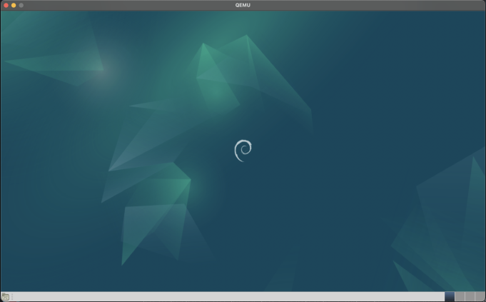

# Préparation d'une machine virtuelle

## Préparation de la machine virtuelle

Pour cette étape, nous avons du configurer une machine virtuelle via le logiciel de virtualisation [**VirtualBox**](https://www.virtualbox.org/).

### Caractéristiques de la machine virtuelle:
| **Nom**           | sae203             |
|-------------------|--------------------|
| **Type**          | Linux              |
| **Version**       | Debian 12 (64-bit) |
| **Mémoire vive**  | 2048 Mo            |
| **Espace disque** | 20 Go              |

### Questions:

**Q:** *Que signifie “64-bit” dans “Debian 64-bit” ?*

**A:** Le terme "64-bit" représente une architecture système pouvant traiter des données par blocs de 64 bits.

**Q:** *Quelle est la configuration réseau utilisée par défaut ?*

**A:**

{ width=500px }

**Q:** *Quel est le nom du fichier XML contenant la configuration de votre machine ?*

**A:** Son nom est ``sae203.vbox``.

**Q:** *Sauriez-vous modifier directement ce fichier de configuration pour mettre 2 processeurs à votre machine ?*

**A:** Pour cela, il suffit de modifier la valeur dans la ligne `<CPU count="x">`, avec x étant le nombre de coeurs à allouer. Dans ce cas, cette ligne de configuration deviendrait:
```xml
<CPU count="2">
```

## Installation de l'OS

Après avoir configuré la machine virtuelle, nous devons installer sur celle-ci [**Debian**](https://www.debian.org/index.fr.html) (ici la version 12, nom de code "*Bookworm*"), avec l'environnement graphique [**MATE**](https://mate-desktop.org/fr/), et quelques logiciels supplémentaires.

Nous avons pour ceci utilisé l'ISO d'installation de Debian ``netinst``, pour **Net**work **Inst**aller, qui requiert un accès réseau.

### Caractéristiques de l'installation Debian:

- **Nom de la machine**: *serveur*
- **Domaine**: *[vide]*
- **Pays/langue**: *France*
- **Miroir**: *http://debian.polytech-lille.fr*
- **Proxy**: *[vide]*
- **Compte administrateur**: *root / root*
- **Compte utilisateur**: *user / user*
- **Partitionnement**: *Une seule partition de la taille du disque*
- **Sélection des logiciels de démarrage**:
	- *Environnement de bureau Debian*
		- **MATE**
	- *Serveur web*
	- *Serveur SSH*
	- *Utilitaires usuels du système*

{ width=500px }

### Questions:

**Q:** *Qu’est-ce qu’un fichier iso bootable ?*

**A:** Un fichier ISO (en référence à la norme internationale [**ISO 9660**](https://en.wikipedia.org/wiki/ISO_9660) qui définit les systèmes de fichiers sur CD et DVD) est un type de fichier représentant une copie du contenu d'un CD ou d'un DVD, contenant des fichiers binaires permettant par exemple d'installer un système d'exploitation sur un ordinateur.

**Q:** *Qu’est-ce que MATE ? GNOME ?*

**A:** [**MATE**](https://mate-desktop.org/fr/) et [**GNOME**](https://www.gnome.org/) sont deux environnements de bureaux pour les systèmes Linux.

**Q:** *Qu’est-ce qu’un serveur web ?*

**A:** Un serveur web est une machine qui stocke des fichiers d'un site web (HTML, CSS...), et interagit avec les autres machines sur un réseau (public ou privé) via le protocole **HTTP(S)**.

**Q:** *Qu’est-ce qu’un serveur ssh ?*

**A:** Un serveur **SSH** (pour **S**ecure **S**hell **P**rotocol), permet à des utilisateurs de se connecter à distance à une machine (avec comme interface un shell de commandes) via un protocole de connection sécurisé.

**Q:** *Qu’est-ce qu’un serveur mandataire ?*

**A:** Un serveur mandataire, ou **proxy**, est une machine qui sert d'intermédiaire dans les communications de deux autres machines.

# Préparation du système

## Accès `sudo` pour *user*

La commande `sudo` permet à un utilisateur (*avec les bonnes permissions*) d'exécuter des commandes en tant qu'administrateur.

Pour ajouter les permissions administrateur à notre utilisateur *user*, nous allons nous connecter en **tty** (affichage textuel) avec la suite de touches `Ctrl` + `Alt` + `1` à l'utilisateur *root*, puis exécuter la commande suivante:

```bash
# Ajoute l'utilisateur user dans le groupe sudo
usermod -aG sudo user
```


**Q:**  *Comparez-le aux outils inclus avec git (et installé précédemment) ainsi qu’avec ce qui serait fait en ligne de commande pure : fonctionnalités avantages, inconvénients…*
- **usermod**: Commande qui permet de modifier les groupes d'un utilisateur.
- **-a**: Option pour ajouter un ou plusieurs groupes.
- **-G**: Option pour spécifier les groupes à ajouter.
- **sudo**: Le groupe (par défaut sur Debian) permettant à un utilisateur d'exécuter des commandes en tant qu'administrateur.
- **user**: Le nom de notre utilisateur.

Il suffit de par la suite se déconnecter, revenir à l'affichage graphique avec la suite de touches `Ctrl` + `Alt` + `6`, puis de se connecter avec notre utilisateur *user*.

En lançant un terminal, nous pouvons vérifier si notre utilisateur possède bien les permissions administrateur:

```bash
user@server:~$ sudo echo test
[sudo] password for user:
test
user@server:~$
```

### Questions:

**Q:** *Comment peut-on savoir à quels groupes appartient l’utilisateur user ?*

**A:** Pour connaître les groupes d'un utilisateur, on utilise la commande **groups**, ici `groups user`.

## Installation des suppléments invités

Pour améliorer le comfort d'utilisation de Linux sur VirtualBox, il faut installer des programmes supplémentaires depuis une image ISO.

{ width=500px }

Une fois le CD des suppléments invités inséré:

1. Monter le CD:
```bash
# Monte le CD de suppléments invités dans /mnt
sudo mount /dev/cdrom /mnt
```

2. Lancer le programme et installer les suppléments:
```bash
sudo /mnt/VBoxLinuxAdditions.run
```

Une fois les suppléments installés, nous pouvons redémarrer la machine virtuelle.

### Questions:

**Q:** *Quel est la version du noyau Linux utilisé par votre VM ? N’oubliez pas, comme pour toutes les questions, de justifier votre réponse.*

**A:** À l'aide de la commande `uname -rs` (-r pour la version, -s pour le nom), nous pouvons connaître la version du kernel Linux présent sur la machine virtuelle. Dans notre cas, il s'agit du kernel `Linux` classique, en version `6.1.0-18-amd64`.

**Q:** *À quoi servent les suppléments invités ? Donner 2 principales raisons de les installer.*

**A:** Les suppléments invités est un ensemble de drivers de périphériques ainsi que d'applications système améliorant la performance et son utilisabilité. Ils intègrent par exemple des **dossiers partagés** entre l'hôte et la machine virtuelle, ainsi qu'un **meilleur support vidéo** à l'aide de drivers d'accélération 3D.

**Q:** *À quoi sert la commande `mount` (dans notre cas de figure et dans le cas général) ?*

**A:** La commande `mount` sert à monter et rendre accessible un système de fichiers (disque dur, clé USB, CD...) sur un répertoire donné en paramètre.

# À propos de la distribution Debian

### Questions:

**Q:** *Qu’est-ce que le Projet Debian ? D’où vient le nom Debian ?*

**A:** Le projet Debian est une association de développeurs indépendants qui ont pour but de fournir un système d'exploitation libre. Le nom **Debian** est une fusion du prénom du créateur de Debian: **Ian** Murdock, et celui de sa femme à l'époque: **Deb**rah.

**Q:** *Il existe 3 durées de prise en charge (support) de ces versions : la durée minimale, la durée en support long terme (LTS) et la durée en support long terme étendue (ELTS). Quelle sont les durées de ces prises en charge ?*

**A:** La durée minimale de support est de:

 - **Durée minimale**: 3 ans
 - **LTS**: 5 ans
 - **ELTS**: 10 ans

**Q:** *Pendant combien de temps les mises à jour de sécurité seront-elles fournies ?*

**A:** Les mises à jour de sécurité sont fournies jusqu'à **1 an** après la sortie de la version suivante.

**Q:** *Combien de version au minimum sont activement maintenues par Debian ? Donnez leur nom générique (= les types de distribution).*

**A:**

 - **Debian 10** - "*Buster*" (2019)
 - **Debian 11** - "*Bullseye*" (2021)
 - **Debian 12** - "*Bookworm*" (2023, actuel)
 - **Debian Unstable** - "*Sid*" (rolling-release)

**Q:** *Chaque distribution majeure possède un nom de code différent. Par exemple, la version majeure actuelle (Debian 12) se nomme Bookworm. D’où viennent les noms de code données aux distributions ?*

**A:** Les noms de code des versions de Debian viennent des noms des personnages de **Toy Story**.

**Q:** *L’un des atouts de Debian fut le nombre d’architecture (= processeurs) officiellement prises en charge. Combien et lesquelles sont prises en charge par la version Bullseye ?*

**A:** Debian 11 "Bullseye" supporte 9 architectures différentes:

 - **AMD64**
 - **AArch64**
 - **ARMel**
 - **ARMhf**
 - **i386**
 - **MIPS**
 - **MIPS64**
 - **POWER64**
 - **IBM S/390**

**Q:** *Quel a été le premier nom de code utilisé ?*

**A:** Le premier nom de code utilisé par le Projet Debian est "**Buzz**".

**Q:** *Quand a-t-il été annoncé ?*

**A:** Le nom de code ainsi que la version ont été annoncés (et sortis) le **17 juin 1996** sur la [**mailing list de Debian**](https://lists.debian.org/debian-announce/1996/msg00021.html).

**Q:** *Quel était le numéro de version de cette distribution ?*

**A:** Il s'agit de la version **1.1**.

**Q:** *Quel est le dernier nom de code annoncé à ce jour ?*

**A:** Le dernier nom de code annoncé par le Projet Debian est "**Forky**".

**Q:** *Quand a-t-il été annoncé ?*

**A:** Le nom de code a été annoncé le **13 octobre 2022** sur la [**mailing list de Debian**](https://lists.debian.org/debian-devel-announce/2022/10/msg00004.html).

**Q:** *Quelle est la version de cette distribution ?*

**A:** Le nom de code "**Forky**" correspond à la version **14** de Debian.

# Installation préconfigurée

Pour cette partie, nous avons du modifier un fichier de configuration pour automatiser une installation de Debian.

Après avoir téléchargé l'archive `autoinstall_Debian.zip` sur Moodle, il a d'abord fallu générer un UUID aléatoire sur le fichier de script `S203-Debian12.viso` avec la commande suivante:

```bash
sed -i -E "s/(--iprt-iso-maker-file-marker-bourne-sh).*$/\1=$(cat /proc/sys/kernel/random/uuid)/" S203-Debian12.viso
```

- **sed**: Pour "**s**tream **ed**itor", c'est un programme UNIX permettant d'appliquer des modifications à des fichiers.
- **-i**: Option pour modifier des fichiers.
- **-E**: Option permettant l'utilisation d'expressions régulières.
- **s/(--iprt-iso-maker-file-marker-bourne-sh).$/\1=**: Sélection de la partie à modifier.
- **cat**: Commande UNIX pour afficher le contenu d'un fichier.
- **/proc/sys/kernel/random/uuid**: Fichier spécial sur Linux permettant de générer aléatoirement des UUID (**U**niversally **U**nique **ID**entifier).
- **S203-Debian12.viso**: Le nom du fichier à modifier.

Cette commande permet de remplaçer tout ce qui se trouve après la ligne `--iprt-iso-maker-file-marker-bourne-sh=` du fichier **S203-Debian12.viso** par un UUID aléatoire.

Après avoir lancé une installation automatique sans rien modifier, on se retrouve avec un système Debian, cependant très peu ergonomique: pas d'affichage graphique, pas de programmes de développement présent, etc.

Pour remédier à cela, nous avons du modifier le fichier de configuration de l'installeur automatique Debian, ici `preseed-fr.cfg`.

Parmi les modifications demandées, on trouve:

- Ajout du groupe `sudo` à l'utilisateur standard
- Installation de l'environnement bureau **MATE**
- Ajout des paquets suivants:
	- `sudo`: Permet l'exécution de commandes en tant qu'administrateur.
	- `git`: Logiciel de gestion de versions.
	- `sqlite3`: Bibliothèque de gestion de bases de données.
	- `curl`: Utilitaire de transfert de données réseau.
	- `bash-completion`: Collections de scripts de complétion pour améliorer l'expérience utilisateur sur le shell `bash`.
	- `neofetch`: Logiciel permettant d'afficher nombreuses informations sur le système et la session en cours.

Pour ajouter les droits `sudo` à l'utilisateur créé pendant l'installation automatique, il suffit de rajouter **sudo** sur la ligne suivante:

`d-i passwd/user-default-groups string audio cdrom video sudo`

Pour ajouter l'environnement de bureau MATE, il suffit de rajouter cette ligne dans le fichier de configuration:

`tasksel tasksel/first multiselect standard ssh-server mate-desktop`

Enfin, pour ajouter les paquets supplémentaires, il suffit de rajouter cette ligne dans le fichier de configuration:

`d-i pkgsel/include string sudo, git, sqlite3, curl, bash-completion, neofetch`

Maintenant que le fichier de configuration est fini, nous pouvons le sauvegarder et recommencer l'installation automatisée pour voir si nos changements ont bien marché.

Une fois l'installation finie, nous pouvons redémarrer la machine virtuelle, et voir que tout a été installé correctement.

{ width=500px }

# Analyse préliminaire de git et des outils graphiques associés

## Configuration globale de git

Nous avons d'abord du configurer notre profil git avec les commandes suivantes (exemple):
```bash
# Change le nom présent dans les commits git
git config --global user.name "[prénom] [NOM]"
# Change l'email présent dans les commits git
git config --global user.email "[adresse mail]"
# Change la branche par défaut pour la création de dépôts locaux git
git config --global init.defaultBranch "master"
```

## Les interfaces graphiques pour git

Pour installer les deux interfaces graphiques de git sur Debian, il suffit d'utiliser les deux commandes suivantes:

```bash
# Installation de gitk et git-gui via APT
sudo apt install gitk
sudo apt install git-gui
```

### Questions:

**Q:** *Qu’est-ce que le logiciel gitk ? Comment se lance-t-il ?*

**A:** Le logiciel `gitk` est un logiciel graphique permettant la visualisation de l'historique des actions faites sur le dépôt. Pour le lancer, il suffit dans un terminal de se déplacer dans un dossier contenant un projet git à l'aide de la commande `cd`, puis d'exécuter la commande `gitk`.

{ width=500px }

**Q:** *Qu’est-ce que le logiciel git-gui ? Comment se lance-t-il ?*

**A:** Le logiciel `git-gui` est une extension de git offrant une interface graphique pour la création de commits, de branches, d'actions fetch/push, etc. Pour le lancer, il suffit de simplement exécuter la commande `git gui` depuis un terminal ou autre lanceur de commandes, et l'interface graphique permettra à l'utilisateur de créer un nouveau dépôt ou d'en ouvrir un déjà existant.

{ width=500px }

## Installons autre chose et comparons

### Questions:

**Q:** *Pourquoi avez-vous choisi ce logiciel ?*

**A:** Nous avons choisi [**Aurees**](https://aurees.com/), car celui-ci est disponible sur tous les systèmes d'exploitation majeurs (Linux, macOS et Windows), ce qui le rend utilisable par tout le monde, sans contrainte, qui ne pose pas de problème en cas de changement de système, ainsi que pour son efficacité dans la résolution des conflits de merge.

**Q:** *Comment l’avez vous installé ?*

**A:** Aurees possède des installateurs pour tout système d'exploitation majeur sur son [site web](https://aurees.com/). N'étant pas présent par défaut sur les depôts apt de Debian, nous avons du télécharger le fichier `.deb` depuis le site, puis l'installer à l'aide de la commande suivante:
```bash
# Installation via DPKG (Debian) de Aurees
sudo dpkg -i AureesSetup-linux.deb
```

**Q:** *Comparez-le aux outils inclus avec git (et installé précédemment) ainsi qu’avec ce qui serait fait en ligne de commande pure : fonctionnalités avantages, inconvénients…*

**A:**

{ width=500px }

# Installation de Gitea

## Préliminaire: redirection de port

Pour permettre à notre machine hôte de se connecter au service web de Gitea, qui sera installé sur la machine virtuelle, il faudra configurer la machine virtuelle pour rediriger le port utilisé par Gitea (ici, le port **3000**) vers la machine hôte.

Pour cela, il suffit de se rendre dans la configuration de la machine virtuelle sur VirtualBox, puis **Réseau** -> **Advanced** -> **Redirection de ports**.

Il suffit enfin d'ajouter la règle TCP de redirection du port 3000 dans la table et de sauvegarder.

{ width=500px }

## Installation de Gitea

### Questions:

**Q:** *Qu’est-ce que Gitea ?*

**A:** Gitea est un logiciel open-source, proposant un service d'hébergement de développement logiciel, utilisant le logiciel de gestion de versions **git**.

**Q:** *À quels logiciels bien connus dans ce domaine peut-on le comparer (en citer au moins 2) ?*

**A:** En services web git gratuits/open-source, permettant du self-host, on peut citer [GitLab](https://about.gitlab.com/) ou encore [Gogs](https://gogs.io/). En service web git propriétaire, sans possibilité de self-hosting, on peut citer le très connu [GitHub](https://github.com/).

## Installation du binaire

Pour commencer l'installation de Gitea, nous allons d'abord télécharger la dernière version binaire disponible.

```bash
# Télécharge le fichier binaire
wget -O gitea https://dl.gitea.com/gitea/1.21.9/gitea-1.21.9-linux-amd64
# Rend le fichier exécutable
chmod +x gitea
```

Pour vérifier qu'il n'y a pas eu de problèmes avec le téléchargement du fichier, on compare son hash **SHA256** avec celui présent sur le site.

```bash
# Hash SHA256 du fichier local
sha256sum gitea
ffd269c8e6910fa21a38849d5155c953a8a83f364470d675e9378dbb3b231fc8  gitea

# Hash SHA256 fourni par Gitea
curl https://dl.gitea.com/gitea/1.21.9/gitea-1.21.9-linux-amd64.sha256
ffd269c8e6910fa21a38849d5155c953a8a83f364470d675e9378dbb3b231fc8  gitea-1.21.9-linux-amd64
```

Étant donné que les hash sont similaires, il n'y a pas eu de problème pendant le téléchargement, alors nous pouvons procéder à l'installation et à la configuration de Gitea.

Pour bien fonctionner, Gitea fonctionne à l'aide d'un utilisateur spécial `git` dédié. Sur Debian, on créé cet utilisateur avec la commande suivante:

```bash
sudo adduser \  # Commande de création d'utilisateur
	--system \  # Utilisateur système
	--shell /bin/bash \  # Shell bash par défaut
	--gecos 'Git Version Control' \  # Informations GECOS pour /etc/passwd
	--group \  # Création d'un groupe git
	--disabled-password \  # Aucun mot de passe
	--home /home/git \  # Création dossier home
	git  # Nom de l'utilisateur
```

Ensuite, il faut créer les dossiers nécessaires aux fichiers de Gitea (logs, db, config, etc.):

```bash
# Création des working directory de Gitea
sudo mkdir -p /var/lib/gitea/{custom,data,log}
# Changement des permissions owner dans /var/lib/gitea (récursif)
sudo chown -R git:git /var/lib/gitea/
# Changement récursif des droits de lecture
sudo chmod -R 750 /var/lib/gitea/
# Création du dossier pour les fichiers de configuration de Gitea
sudo mkdir /etc/gitea
# Changement des permissions owner (on ajoute le groupe git temporairement le temps de l'installation)
sudo chown root:git /etc/gitea
# Changement des droits de lecture
sudo chmod 770 /etc/gitea
```

Une fois les dossiers créés, nous pouvons déplacer l'exécutable de Gitea dans un dossier du **PATH**:

```bash
sudo mv gitea /usr/local/bin/gitea
```

Maintenant que tous les fichiers/dossiers ont été créés, nous pouvons lancer et installer Gitea. Pour permettre le lancement automatique de Gitea au démarrage de Debian, nous allons créer un **service systemd**.

Pour faciliter la tâche, Gitea fournit sur GitHub un fichier de service systemd déjà prêt. On commence par télécharger le fichier service, qu'on stocke dans le dossier des services systemd:

```bash
sudo wget -O /etc/systemd/system/gitea.service https://raw.githubusercontent.com/go-gitea/gitea/release/v1.21/contrib/systemd/gitea.service
```

Ensuite, on vérifie son contenu, si il correspond avec les configurations faites précédemment.

```bash
sudo nano /etc/systemd/systemd/gitea.service
[..]
User=git
Group=git
WorkingDirectory=/var/lib/gitea/
```

Enfin, on lance le service de Gitea avec la commande `systemctl`:

```bash
# Lancer le service Gitea au démarrage du système
sudo systemctl enable gitea
# Démarrer le service Gitea
sudo systemctl start gitea
```

Maintenant que Gitea est lancé, nous pouvons lancer un navigateur, puis se connecter à l'adresse `localhost:3000` pour avoir accès à la page d'installation de Gitea.

- On sélectionne **SQLite3** comme base de données.
- On laisse toutes les autres informations par défaut.

{ width=500px }

{ width=500px }

- On créé un compte administrateur avec les informations suivantes:
	- **Nom**: *gitea*
	- **Adresse e-mail**: *git@localhost*
	- **Mot de passe**: gitea

{ width=500px }

Une fois tout configuré, on peut cliquer sur **Installer Gitea**.

Après une vingtaine de secondes, on arrive sur la page principale de notre interface Gitea.

 { width=500px }

Une fois l'installation de Gitea finie, nous pouvons protéger les fichiers dans **/etc/gitea**:

```bash
# Arrêt temporaire du service Gitea
sudo systemctl stop gitea
# Changement des droits
sudo chmod 750 /etc/gitea
sudo chmod 640 /etc/gitea/app.ini
# Redémarrage de Gitea
sudo systemctl start gitea
```

## Mise à jour du binaire de service Gitea

### Questions:

**Q:** *Quelle version du binaire avez-vous installé ? Donnez la version et la commande permettant d’obtenir cette information.*

**A:** La version installée est la **1.21.9**. Nous pouvons connaître cette information via la commande suivante:
```bash
gitea --version
```

**Q:** *Comment faire pour mettre à jour le binaire de votre service sans devoir tout reconfigurer ? Essayez en mettant à jour vers la version 1.22-dev.*

**A:** Pour mettre à jour Gitea, il suffit de changer le fichier binaire que nous avons déplacé dans **/usr/local/bin**.

Ici, nous souhaitons mettre à jour de la version **1.21.9** (dernière version stable) à la version **1.22-dev** (dernière version de développement).

Pour commencer, on **arrête le service** Gitea (si il est en cours):

```bash
sudo systemctl stop gitea
```

Ensuite, on télécharge le fichier binaire **nightly** de Gitea:

```bash
wget -O gitea https://dl.gitea.com/gitea/main/gitea-main-nightly-linux-amd64
chmod +x gitea
```

On remplace le précédent fichier binaire de Gitea par le nouveau:

```bash
sudo mv gitea /usr/local/bin/gitea
```

Enfin, on redémarre le service Gitea:

```bash
sudo systemctl start gitea
```

On peut vérifier la version de Gitea avec la commande suivante:

```bash
gitea --version
Gitea version 1.22.0+dev-1144-g5c91d7920 [..]
```

## Tests d'utilisation

# Sources et références

- https://www.debian.org/
- https://en.wikipedia.org/wiki/Debian_version_history
- https://wiki.debian.org/LTS
- https://www.debian.org/releases/bullseye/
- https://www.debian.org/releases/stable/amd64/apb.en.html
- https://www.virtualbox.org/manual/ch04.html
- https://git-scm.com/docs/gitk/
- https://git-scm.com/docs/git-gui
- https://docs.gitea.com/
